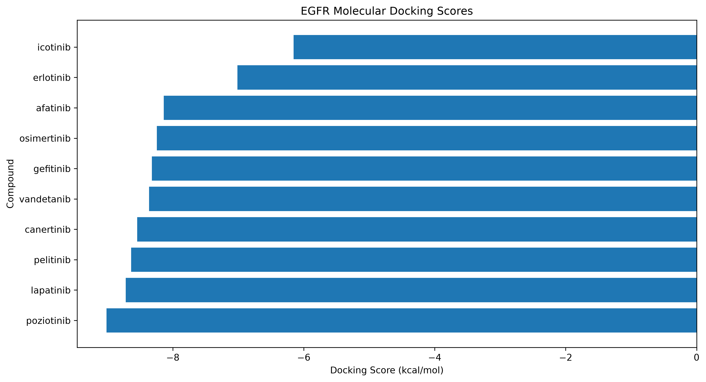
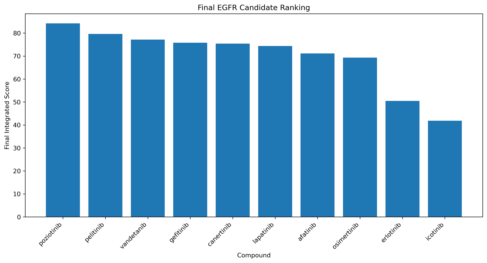
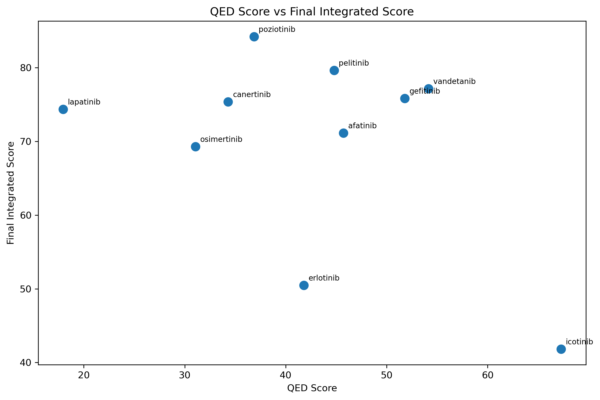
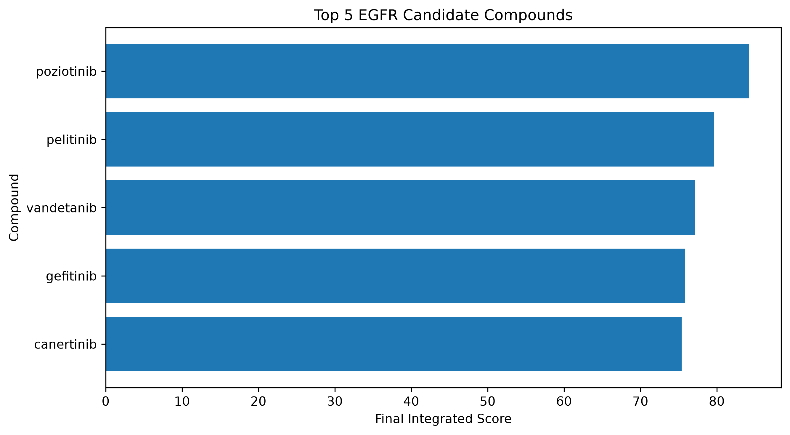

## Results

The pipeline generated computational results for EGFR (PDB: 1M17), including molecular docking, drug-likeness, ADMET prediction, integrated candidate scoring, and lead analysis.

### Top Ranked Candidates

| Rank | Compound | Docking Score (kcal/mol) | Final Integrated Score |
|---|---|---:|---:|
| 1 | Poziotinib | -9.012 | 84.21 |
| 2 | Pelitinib | -8.638 | 79.65 |
| 3 | Vandetanib | -8.362 | 77.16 |
| 4 | Gefitinib | -8.320 | 75.83 |
| 5 | Canertinib | -8.544 | 75.38 |

### Visualizations

The pipeline automatically generates the following visual outputs:

#### 1. Docking Score Comparison

#### 2. Final Integrated Candidate Scores

#### 3. QED vs Final Integrated Score

#### 4. Top 5 Candidate Comparison

> **Note:** These are computational predictions generated by the pipeline and should not be interpreted as experimental evidence of therapeutic efficacy. Experimental validation is required.